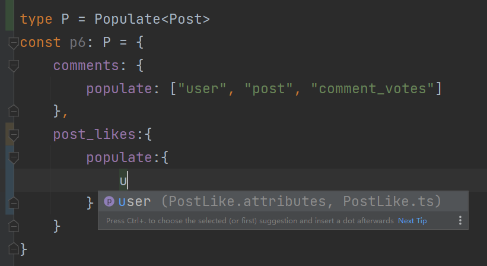

# strapi-common-api

provide some common request api service functions and
strapi types support for strapi based frontend apps,
which is something that is not yet officially implemented
by strapi[[1]](https://github.com/strapi/strapi/blob/main/packages/core/database/lib/index.d.ts)
[[2]](https://github.com/strapi/strapi/blob/main/packages/core/strapi/lib/core-api/service/index.d.ts)


data types were generated by [types-4-strapi](https://www.npmjs.com/package/types-4-strapi)

see also [strapi](https://strapi.io), [typescript](https://www.typescriptlang.org/)

## install

```
npm install strapi-common-api axios qs -s 
```

or

```
yarn add strapi-common-api axios qs
```

## usage - types

your IDE will give some hints when coding objects of these types, like this



err... there are too many types exported, here only introduce some key types

### Populate

strapi [populate](https://docs.strapi.io/dev-docs/api/rest/populate-select#population) object type

```typescript
import {Populate} from "strapi-common-api";
import {Post} from "./Post";

type P = Populate<Post>

// common populate
const p1: P = "deep"
const p2: P = ["deep", 10]
const p3: P = 10
const p4: P = "*"
const p5: P = ["user", "comments"]
const p6: P = {
    // multi level populate
    user: {
        populate: "*"
    },
    comments: {
        populate: ["user", "post", "comment_votes"]
    },

    // deep populate
    post_likes: {
        populate: {
            user: {
                populate: "*"
            }
        }
    }
}
```

### Filters

strapi [filters](https://docs.strapi.io/dev-docs/api/rest/filters-locale-publication#filtering) object type

```typescript
import {Filters} from "strapi-common-api";
import {Post} from "./Post";

type F = Filters<Post>

const f1: F = {
    // common field
    content: {
        $contains: "haha"
    },

    // relation field
    user: {
        username: {
            $eq: "littlebadbad",
            $null: true,
            $containsi: "little",
            $startsWith: "l"
        }
    },

    // array relation field
    comments: {
        content: {
            $startsWith: "haha"
        },
        user: {
            username: {
                $startsWith: "l"
            }
        }
    },

    // logical operator filter
    $and: [
        {content: {$contains: "hello"}},
        {title: {$contains: "hi"}}
    ],
    $not: {
        user: {
            username: {
                $startsWith: "a"
            }
        }
    }
}
```

### Sort

strapi [sort](https://docs.strapi.io/dev-docs/api/rest/sort-pagination#sorting) object type

```typescript
import {Sort} from "strapi-common-api";
import {Post} from "./Post";

type S = Sort<Post>

const s1: S = "content"
const s2: S = ["content", "id"]
const s3: S = {
    content: "DESC",
    title: "ASC"
}
const s4: S = [
    {
        content: "DESC"
    },
    {
        title: "ASC"
    }
]
```

### Query

query object followed by each strapi url, use `qs` library to stringify it, schema of query object follows
the [strapi api parameters](https://docs.strapi.io/developer-docs/latest/developer-resources/database-apis-reference/rest/api-parameters.html)

includes: locale, filters, publicationState, pagination, sort, fields, populate

```typescript
// Post type was generated by types-4-strapi
import {Post} from "./Post";
import {Query, Payload} from "strapi-common-api"

export function getPosts(query?: Query<Post>): Promise<Payload<Post[]>> {
    return strapiRequest.get(`/posts?${qs.stringify(query, {encodeValuesOnly: true})}`)
        .then(r => r.data)
}

// here your editor will give you some type hints
getPosts({
    filters: {
        title: {$contains: "test"}
    },
    populate: ["user"],
    sort: ["updatedAt"]
})
```

## usage - functions

the above types were wrapped in functions below,
declare the type of the entity to get the correct
type prompt information

but at first remember to override
strapi request instance, which based on
[axios](https://axios-http.com/) module, you can customize 
your interceptors (such as add jwt token before
request) or some other params (such as base url)

```typescript
import {auth, collection, single,strapiRequest} from "strapi-common-api"
import {Post} from "./Post";
import {Global} from "./Global";

// override your strapi api url like this
strapiRequest.defaults.baseURL = "http://localhost:1337/api"// defalut base url value

// here your editor will give you some hints on params and return data
auth.login({identifier, password})
    .then(({user, jwt}) => {
        // do something ...
    })

collection.getMany<Post>("posts", {
    filters: {
        title: {
            $eq: "test"
        }
    },
    populate: {// support multi-level populate
        user: {
            populate: ["avatar"]
        }
    }
}).then(({data, meta}) => {
    // do something ...
})

single.get<Global>("global").then(r => {
    // do something ...
})
```

### collection type api

- getMany

get many resources

Params:

type – strapi content-type name

query – strapi query object

- getOne

get one resource

Params:

type – strapi content-type name

id – resources id

query – strapi query object

- post

add one resource

Params:

type – strapi content-type name

data – post data

query – strapi query object

- put

put one resource

Params:

type – strapi content-type name

id – resource id

data – post data

query – strapi query object

- remove

remove one resource

Params:

type – strapi content-type name

id – resource id

query – strapi query object

### single type api

- get
- put
- remove

### auth api

- login
- register
- forgotPassword
- resetPassword
- changePassword
- sendEmailConfirm
- emailConfirm

